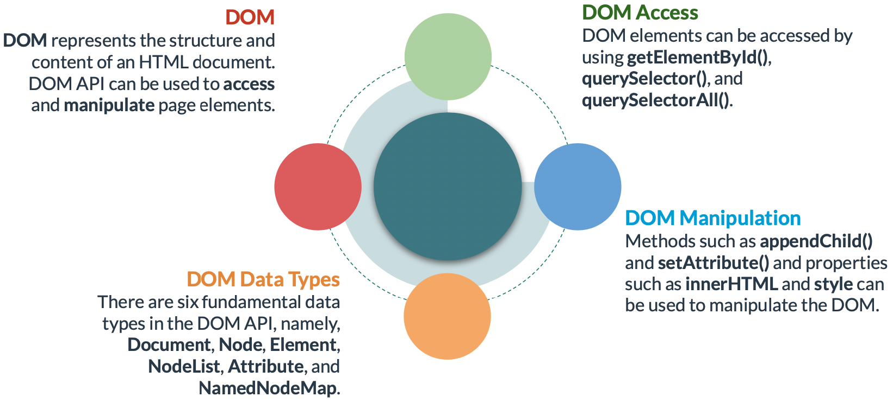

# DOM

The Document Object Model (DOM) represents the structure and content of an HTML document as objects and nodes. Allows accessing and manipulating the **structure**, **style**, and **content** of the web page.

There are six fundamental DOM data types, namely, **Document**, **Node**, **Element**, **NodeList**, **Attribute**, and **NamedNodeMap**.

Methods are available for retrieving elements from the DOM. These are **getElementById()**, **querySelector()**, and **querySelectorAll()**. For DOM manipulation, methods such as **appendChild()** and **setAttribute()** and properties such as **innerHTML** and **style** can be utilized.

### **Window**

The window object represents the browser window containing a DOM document and exposes several properties and methods. Global objects, functions, and variables automatically become members of this object. Some properties/methods are described below.

### DOM Tree

A DOM tree is a data representation in which the nodes represent the contents of an HTML document.

### **DOM Data Types**

DOM API provides access to six data types:

- `Document` - An object of type document represents the root document object of the HTML page.
- `Node` - Each object in an HTML document is a node of some kind. For example, an element or text node.
- `Element` - Represents a node of type element. An example is the <table> element.
- `NodeList` - Represents an array of elements. The document.querySelectorAll() method returns a nodeList.
- `Attribute` - Is a standard or non-standard property defined on an HTML element. For example, the id attribute of a 
 element.
- `NamedNodeMap` - Is an array of elements whose items can be accessed by name or index. They are in no particular order.

### **CSS Selectors for DOM Queries**

### **Retrieving DOM Elements**

- **querySelector() -** Accepts a group of selectors as its only parameter. It returns the first element that matches the group of selectors.
- **querySelectorAll() -** Accepts a group of selectors as its parameter. It returns a NodeList of all the elements that match the specified selectors.

[Document](https://javascript.info/document)