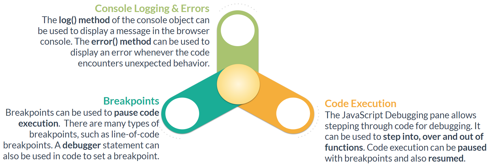

# DevTools

Tags: focus on force

## Overview



The **Elements** panel is used to inspect and modify the DOM and CSS.

The **Console** panel is used to execute JavaScript code and view logged messages.

The **Sources** panel consist of three parts namely, File Navigator pane, Code Editor pane, and JavaScript Debugging pane.

The **Scope** pane in the JavaScript Debugging pane can be used to check the values of variables.

The **Watch** pane can be used to monitor the values over time.

The **Network** panel can be used to check the network activity of a web page

## **Console**

Used to execute JavaScript code and view logged messages. Turn on developer tools with F12 (Mac: Cmd+Opt+I)


### Log

The **log()** method of the console object can be used to output informational messages in the console for debugging.

```jsx
function greeting(name) {
	console.log(`Welcome ${name}!`);
}

greeting('James'); //output: Welcome James!

// This example uses console.log to output two objects.
let user1 = {
	userid: 0,
	name: 'Mary'
};

let user2 = {
	userid: 1,
	name: 'Sam'
};

console.log(user1, user2); //output: {userid: 0, name: 'Mary'} {userid: 1, name: 'Sam'}
```

There are four log levels, namely, verbose, info, warnings, and errors.


Console sidebar is used to organize logs and provides clarity in debugging experience.


### Custom Logs

User can add Styling to the console logs in order to make logs Custom . The Syntax for it is to add the CSS styling as a parameter to the logs which will replace %c in the logs as shown in the example below .

```jsx
// Custom Console log example
  const spacing = '10px';
  const styles =
        `padding: ${spacing}; background-color: white; color: green; font-style:
         italic; border: 1px solid black; font-size: 2em;`;
  console.log('%cCustom Log example', styles);
```

output:


### Trace

The **trace()** method outputs a stack trace to the console

```jsx
function foo() {
  function bar() {
    console.trace();
  }
  bar();
}

foo();
```

output:


The console can be made persistent during browser navigation and refresh by enabling the ‘Preserve log’ option in the console Settings.


### Time

Whenever we want to know the amount of time spend by a block or a function, we can make use of the **time()** and **timeEnd()**.

They take a label which must be same, and the code inside can be anything( function, object, simple console).

```jsx
console.time('abc');
let fun = function(){
	console.log('fun is running');
}
let fun2 = function(){
	console.log('fun2 is running..');
}
fun(); // calling fun();
fun2(); // calling fun2();
console.timeEnd('abc');
```

output:


### Table

The **table()** method generate a table inside a console. The input must be an array or an object which will be shown as a table.


### Count

**count()** method is used to count the number that the function hit by this counting method.


The **countReset()** method resets counter used with count().

### Group

**group()** and **groupEnd()** methods of the console object allows us to group contents in a separate block, which will be indented. Just like the time() and the timeEnd() they also accepts label, again of same value.


### Assert

The **assert()** method writes an error message to the console if the assertion is false. If the assertion is true, nothing happens.


## **Breakpoints**

A breakpoint pause code execution to allow investigation of code behavior at a specific point.

There are several types of breakpoints used for different purposes.


### **Line-of-code Breakpoint**

In this example, a line-of-code breakpoint is created by opening the debugger and clicking line 6.


We can also pause the code by using the `debugger` command in it, like this:

```jsx
function hello(name) {
  let phrase = `Hello, ${name}!`;

  debugger;  // <-- the debugger stops here

  say(phrase);
}
```

Such command works only when the development tools are open, otherwise the browser ignores it.

### **DOM Change Breakpoint**

In this example, a DOM breakpoint is set on the 'message' div to get notified what code is changing that div.


### **XHR/Fetch Breakpoint**

In this example, an XHR/Fetch breakpoint is entered for the 'jsonplaceholder.typicode.com' url.

```jsx
fetch('https://jsonplaceholder.typicode.com/todos/')
.then(resp => resp.json()) 
.then(data => console.log(data));
```


### **Event Listener Breakpoint**

In this example, a breakpoint is placed under 'Event Listener Breakpoints' for the 'mouse click' events.

```jsx
const btn = document.getElementById('finish');

btn.addEventListener('click', function() { 
	submitScore();
});
```


### **Exception Breakpoint**

In this example, the exception breakpoint is activated by clicking on it. The code pauses at the exception.

```jsx
const date = '2020-11-3';
console.log(date.getSeconds()); // Invalid Date object, so exception is thrown.
```


### **Function Breakpoint**

In this example, the function is defined and then the console is used to activate the debugger. The method **debug()** is used to set the breakpoint and **undebug()** is used to clear the breakpoint.

```jsx
function getRandomInt(lowerLimit, upperLimit) {
	lowerLimit = Math.ceil(lowerLimit); 
	upperLimit = Math.floor(upperLimit);
	return Math.floor(Math.random() * (upperLimit - lowerLimit)) + lowerLimit;
};

//set breakpoint
debug(getRandomInt);
//clear breakpoint
undebug(getRandomInt);
```

## **Pause and look around**


1. **`Watch` – shows current values for any expressions.**
    
    You can click the plus `+` and input an expression. The debugger will show its value, automatically recalculating it in the process of execution.
    
2. **`Call Stack` – shows the nested calls chain.**
    
    At the current moment the debugger is inside `hello()` call, called by a script in `index.html` (no function there, so it’s called “anonymous”).
    
    If you click on a stack item (e.g. “anonymous”), the debugger jumps to the corresponding code, and all its variables can be examined as well.
    
3. **`Scope` – current variables.**
    
    `Local` shows local function variables. You can also see their values highlighted right over the source.
    
    `Global` has global variables (out of any functions).
    
    There’s also `this` keyword there that we didn’t study yet, but we’ll do that soon.
    

## **Stepping through Code**

The JavaScript Debugging pane can be used with breakpoints to step through the execution of the code, one line at a time.

The **Resume** option allows resuming the execution of the code up to the next breakpoint.

The **Step into next function call** option allows stepping through the execution of the next function, one line at a time.

The **Step over next function call** option allows executing the next function without stepping into it.

The **Step out of current function** option allows stepping out of the current function.


## **Network Panel**

The Network panel can be utilized to inspect the network activity of a page.


The network panel allows bandwidth throttling to simulate network bandwidth congestion and determine how an application behaves in the different network states.


The browser cache can be disabled from the Network panel to prevent caching. Also, when the DevTool is open, different options are available for reloading a page.


## Links

[Debugging in the browser](https://javascript.info/debugging-chrome)