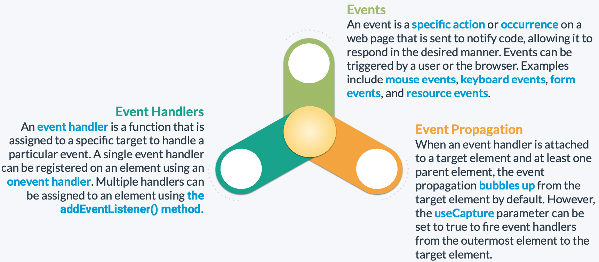

# Events




Some common examples of these types of events are as follows:


There are various events that are common across browsers. These are called standard events. Some of the most commonly used standard events are as follows:


### **Custom Events**

A custom event can be created using the CustomEvent() constructor and dispatched using the dispatchEvent() method.


### **Event Handlers**

An event handler is a function that is assigned to a specific target (e.g., an HTML element) to handle a particular event (e.g., the click event). It is executed when the event is detected.


Two common approaches are used for handling events in JavaScript.

- **Using addEventListener() -** The addEventListener() method of the EventTarget object allows setting up a function that is called whenever the specified event is delivered to the target.
    
    ```jsx
    const loginButton = document.getElementById('login-button');
    loginButton.addEventListener('click', function(event) {
    	loginUser(event);
    });
    ```
    
    The example below shows how to use addEventListener() to set up multiple handlers 
    for an element.
    
    ```jsx
    const loginButton = document.getElementById('login-button');
    
    loginButton.addEventListener('click', function(event) {
    	eventloginUser(event);
    });
    
    loginButton.addEventListener('click', function(event) {
    	event.target.style.color = 'white';
    });
    
    loginButton.addEventListener('mouseleave', function(event) {
    	event.target.style.color = 'black';
    });
    ```
    
- **Registering onevent handlers -** The onevent handler property of an element (for example, ‘onclick’) can be assigned to a single event handler function that is called when the event occurs.
    
    ```jsx
    <button id="login-button" onclick="loginUser()">Login</button>
    
    function loginUser() {
    	console.log('Logging in...');
    };
    ```
    
    The same onevent handlers used in the DOM (onclick, onkeydown, onfocus, onchange, etc) can also be used directly in JavaScript.
    
    ```jsx
    <form>
    	<label for="user">User:</label><br>
    	<input type="text" id="user" name="user"><br>
    	<label for="pass">Password:</label><br>
    	<input type="password" id="pass" name="pass">
    </form>
    
    document.getElementById('pass').onchange = function(event) {
    	let pass = document.getElementById('pass').value;
    	let user = document.getElementById('user').value;
    	console.log(user, pass);
    )
    ```
    

### **DOM Event Properties**


### **Event Propagation**

When an event is fired on an element that has parent elements, two different phases are run in modern web browsers. These are called capturing and bubbling.

- **Capturing** - In the capturing phase, the browser checks for an event handler for the fired event on the outermost ancestor (<html>) and runs it. Moving from top to bottom, the same is done for each next element until the browser reaches the target element.
- **Bubbling -** In the bubbling phase, the browser checks for an event handler for the fired event on the target element and runs it. Moving from bottom to top, the same is done for each immediate ancestor element until the browser reaches <html>.

If a target element and at least one ancestor have an event handler for the same event, the handling of the event bubbles up from the target element to the outermost element, unless the useCapture parameter is set to true.


The Event interface provides two methods to alter the behavior of events.

- **stopPropagation() -** prevents further propagation of the current event in the capturing and bubbling phases. It does not prevent the occurrence of default behaviors associated with the event.
- **preventDefault() -** can be used to prevent the occurrence of the default action associated with an event. For example, when a user clicks on a checkbox, the default action of toggling the checkbox can be blocked.