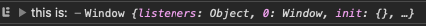

# Functions

### **Types of Functions**

- **Outer Functions** - Functions may be nested. The outer function encloses other function(s) inside its code block;
- **Inner Functions** - Is contained within the code block of another function;
- **Immediately Invoked Function Expression (IIFE)** - A function that is invoked at the same time it is defined.

```jsx
function fib(num1, num2) { // The 'fib' function is an 'outer' function. It is also a 'named' function.
	let num3 = function() { // This 'inner' function is an 'anonymous' function.
		return num1 + num2;
}(); // This function is also invoked immediately using the parentheses. Therefore, it is an IIFE.
	return [num1, num2, num3]
};

const arr = fib(0, 1);
console.log(arr); //[0,1,1]
```

- **Arrow Function** - is a specialized form of a function expression and has a compact syntax. In addition to compact syntax, arrow functions determine the value of the this keyword differently than traditional functions.
    - Traditional Functions - The this keyword is set to the object that invoked the function. Otherwise, the this keyword defaults to the global object.
        
        ```jsx
        function fn() {
        	return this
        ;}
        console.log('this is: ', fn());
        ```
        
        
        
    - Arrow Functions - The this keyword does not default to the global object. The value of this is determined by the context of where the function is called.
        
        ```jsx
        var person = {
        	height:172,
        	weight:80,
        	sayHeight: function () {
        		console.log('My height is:', this.height);
        		console.log('this is: ', this);
        	},
        	sayWeight: () => {
        		console.log('My weight is:', this.weight);
        		console.log('this is: ', this);
        	}
        }
        
        // this context is set to the person object.
        person.sayHeight();
        
        // called at the global scope. this is set to Window.
        person.sayWeight();
        ```
        
        
        

### **Local variables**

A variable declared inside a function is only visible inside that function.

```jsx
function showMessage() {
  let message = "Hello, I'm JavaScript!"; // local variable

  alert( message );
}

showMessage(); // Hello, I'm JavaScript!

alert( message ); // <-- Error! The variable is local to the function
```

### **Outer variables**

A function can access an outer variable and can modify it as well, for example:

```jsx
let userName = 'John';

function showMessage() {
  userName = "Bob"; // (1) changed the outer variable

  let message = 'Hello, ' + userName;
  alert(message);
}

alert( userName ); // John before the function call

showMessage();

alert( userName ); // Bob, the value was modified by the function
```

The outer variable is only used if there’s no local one.

If a same-named variable is declared inside the function then it *shadows* the outer one. For instance, in the code below the function uses the local `userName`. The outer one is ignored:

```jsx
let userName = 'John';

function showMessage() {
  let userName = "Bob"; // declare a local variable

  let message = 'Hello, ' + userName; // Bob
  alert(message);
}

// the function will create and use its own userName
showMessage();

alert( userName ); // John, unchanged, the function did not access the outer variable
```

### **Global variables**

Variables declared outside of any function, such as the outer `userName` in the code above, are called *global*.

Global variables are visible from any function (unless shadowed by locals). It’s a good practice to minimize the use of global variables.

### **Parameters**

we have a variable `from` and pass it to the function. Please note: the function changes `from`, but the change is not seen outside, because a function always gets a copy of the value:

```jsx
function showMessage(from, text) {

  from = '*' + from + '*'; // make "from" look nicer

  alert( from + ': ' + text );
}

let from = "Ann";

showMessage(from, "Hello"); // *Ann*: Hello

// the value of "from" is the same, the function modified a local copy
alert( from ); // Ann
```

### **Default values**

```jsx
function showMessage(from, text = "no text given") {
  alert( from + ": " + text );
}

showMessage("Ann"); // Ann: no text given
```

Now if the `text` parameter is not passed, it will get the value `"no text given"`

Here `"no text given"` is a string, but it can be a more complex expression, which is only evaluated and assigned if the parameter is missing. So, this is also possible:

```jsx
function showMessage(from, text = anotherFunction()) {
  // anotherFunction() only executed if no text given
  // its result becomes the value of text
}
```

Modern JavaScript engines support the nullish coalescing operator `??`, it’s better when most false values, such as `0`, should be considered “normal”:

```jsx
function showCount(count) {
  // if count is undefined or null, show "unknown"
  alert(count ?? "unknown");
}

showCount(0); // 0
showCount(null); // unknown
showCount(); // unknown
```

### **Returning a value**

If a function does not return a value, it is the same as if it returns `undefined`:

```jsx
function doNothing() { /* empty */ }

alert( doNothing() === undefined ); // true
```

An empty `return` is also the same as `return undefined`:

```jsx
function doNothing() {
  return;
}

alert( doNothing() === undefined ); // true
```

**Never add a newline between `return` and the value**

For a long expression in `return`, it might be tempting to put it on a separate line, like this:

```jsx
return
 (some + long + expression + or + whatever * f(a) + f(b))
```

That doesn’t work, because JavaScript assumes a semicolon after `return`. That’ll work the same as:

```jsx
return;
 (some + long + expression + or + whatever * f(a) + f(b))
```

If we want the returned expression to wrap across multiple lines, we should start it at the same line as `return`. Or at least put the opening parentheses there as follows:

```jsx
return (
  some + long + expression
  + or +
  whatever * f(a) + f(b)
)
```

### **Rest parameters**

The rest parameter syntax allows us to represent an indefinite number of arguments as an array.

In the following example, the function `multiply` uses *rest parameters* to collect arguments from the second one to the end. The function then multiplies these by the first argument.

```jsx
function multiply(multiplier, ...theArgs) {
  return theArgs.map(x => multiplier * x);
}

var arr = multiply(2, 1, 2, 3);
console.log(arr); // [2, 4, 6]
```

### **Apply, Call, and Bind**

The default value for the keyword ‘this’ can be changed using one of three methods available for functions.

- **Apply** - invokes a function and assigns the object passed in to the keyword ‘this’. Arguments for the function are passed in as an array.
- **Call** - invokes a function and assigns the object passed in to the keyword ‘this’. Arguments for the function are passed in as a comma separated list.
- **Bind** - returns a new function. The object passed in is assigned to the keyword ‘this’ when that new function is invoked. Arguments may be bound to the new function as well.

This example shows an application of call, apply and bind to invoke a function on the 'objGreet' object, while assigning the value of 'this' to a different object; either 'user1' or 'user2'.

```jsx
let objGreet = {
	morningGreet(punct) {
   console.log(`Good morning ${this.firstName}${punct}`);
  },
	eveningGreet(punct) {
    console.log(`Good evening ${this.firstName}${punct}`);
  }
};

let user1 = {firstName: 'Mary'};
let user2 = {firstName: 'Sam'};

// call invokes the function, and passes in the 'punct' parameter.
objGreet.morningGreet.call(user1, '!');
// apply invokes the function, and passes in the 'punct' parameter as an array.
objGreet.eveningGreet.apply(user2, ['?']);
// bind returns a function and binds the 'punct' parameter to the function, which is invoked using parentheses.
objGreet.eveningGreet.bind(user1, '.')();
```

### **Generators**

is defined with an asterisk (*), when such function is called, it doesn’t run its code. Instead it returns a special object, called “generator object”, to manage the execution. It uses the **yield** keyword internally to pause the function and return the value in the current iteration.

The main method of a generator is `next()`. When called, it runs the execution until the nearest `yield <value>` statement (`value` can be omitted, then it’s `undefined`). Then the function execution pauses, and the yielded `value` is returned to the outer code.

The result of `next()` is always an object with two properties:

- `value`: the yielded value.
- `done`: `true` if the function code has finished, otherwise `false`.

```jsx
function* generateSequence() {
  yield 1;
  yield 2;
  return 3;
}

// "generator function" creates "generator object"
let generator = generateSequence();

let one = generator.next();
alert(JSON.stringify(one)); // {value: 1, done: false}

let three = generator.next();
alert(JSON.stringify(three)); // {value: 3, done: true}
```

`*` Iterations ignores the last value, when done: true. So, if we want all results 

### **Predefined functions**

- **`eval()`** method evaluates JavaScript code represented as a string.
- **`uneval()`** method creates a string representation of the source code of an `[Object]`.
- **`isFinite()`** function determines whether the passed value is a finite number. If needed, the parameter is first converted to a number.
- **`isNaN()`** function determines whether a value is `[NaN]` or not. Note: coercion inside the `isNaN` function has interesting rules; you may alternatively want to use `Number.isNaN()`, as defined in ECMAScript 2015, or you can use `typeof` to determine if the value is Not-A-Number.
- **`parseFloat()`** function parses a string argument and returns a floating point number.
- **`decodeURI()`** function decodes a Uniform Resource Identifier (URI) previously created by `encodeURI` or by a similar routine.
- **`encodeURI()`** method encodes a Uniform Resource Identifier (URI) by replacing each instance of certain characters by one, two, three, or four escape sequences representing the UTF-8 encoding of the character

### **Summary**

- Values passed to a function as parameters are copied to its local variables.
- A function may access outer variables. But it works only from inside out. The code outside of the function doesn’t see its local variables.
- A function can return a value. If it doesn’t, then its result is `undefined`.

To make the code clean and easy to understand, it’s recommended to use mainly local variables and parameters in the function, not outer variables.

It is always easier to understand a function which gets parameters, works with them and returns a result than a function which gets no parameters, but modifies outer variables as a side effect.

Function naming:

- A name should clearly describe what the function does. When we see a function call in the code, a good name instantly gives us an understanding what it does and returns.
- A function is an action, so function names are usually verbal.
- There exist many well-known function prefixes like `create…`, `show…`, `get…`, `check…` and so on. Use them to hint what a function does.

Functions are the main building blocks of scripts. Now we’ve covered the basics, so we actually can start creating and using them. But that’s only the beginning of the path. We are going to return to them many times, going more deeply into their advanced features.