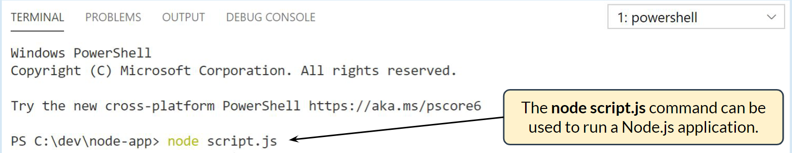

# Node.js CLI

Tags: focus on force

There are various command line options in Node.js. They include helpful run-time options, built-in debugging, and multiple ways of executing scripts.

The node script.js command can be used to run a Node.js application named script.js. It must be executed from the same directory that contains the script.js file.

### **Node.js REPL**

execute JavaScript code in REPL mode. REPL is a programming language environment that stands for Read Evaluate Print Loop. It takes a single expression as user input and returns the output.

### **Node.js REPL Commands**

The REPL mode in Node.js supports some special commands, all of which start with a dot.

### **Command Line Arguments**

When executing a Node.js application, arguments can be provided. An argument can be standalone or have a key and a value. The ‘argv’ property of the ‘process’ object can be accessed to obtain all the command line arguments.

### **Environment Variables**

Allow a Node.js app to behave differently based on the environment. The ‘env’ property of the ‘process’ object is used to access them.

Environment variables can be set using the command line and used in code by accessing process.env.

### **NPM Commands**

There are various CLI commands available for npm. Some of the most common commands are as follows.

When using the npm install command, the -g or --global flag can be appended to the command in order to install the package globally. The --save-dev flag can be used to install the package under devDependencies in package.json.

The npm run command runs the specified command from the ‘scripts’ object of the package. If no command has been specified, it lists the available commands.

### **Debugging Commands**

The node inspect command can be used to launch the debugger. Commands can be executed to set breakpoints, step through code, watch expressions, etc.

### **Breakpoints and Watchers**

It is also possible to use a command to watch expression and variable values while debugging.

Commands are available for stepping through code while debugging:

