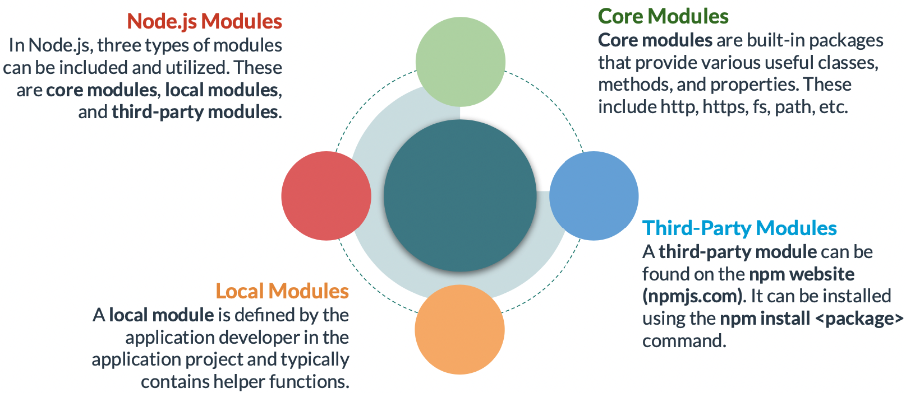

# Node Modules

### **Core Modules**

Some of the most important core modules in Node.js are as follows:

The example below makes use of the **path** module to get the directory and last portion of the specified file path.

The example below makes use of the **util** module to check whether a function is an async function.

A developer can create a local module in a Node.js application for a particular set of functionalities. For example, a helper module can be created, exported and included in the main application file.

The example below makes use of the events module to create and handle a custom event.

### **Popular Third-Party Modules**

The example below shows how to use the third-party module named Express in a Node.js application to create a web server and handle incoming GET requests.

The example below shows how to use two third-party modules named Moment and Chalk in a Node.js application to get and display a formatted date that is fourteen days from now.

