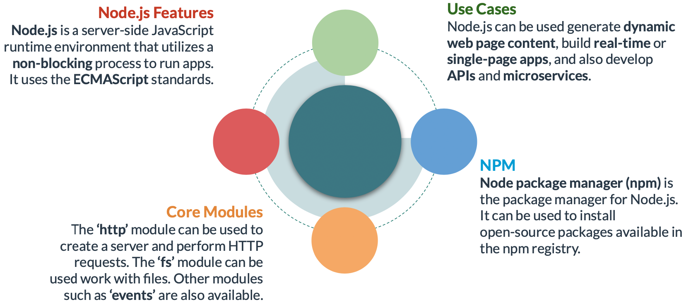

# Server Side JavaScript



### **Building a Web Server**

The http module can be used to create a server. The example below shows the definition of a web server in a file named app.js

```jsx
//Include the 'http' module by using the built-in 'require' function
const http = require('http');
const port = 3000;

//Use http.createServer() to create a new instance of http.Server
const server = http.createServer((req, res) => {
	//Define the callback function that handles incoming requests
	res.statusCode = 200;    
	res.setHeader('Content-Type', 'text/plain');    
	res.end('Welcome!');
});

// Use server.listen() to start the server listening for connections.
server.listen(port, () => {
	console.log(`Server running at port ${port}`);
});
```

### **Handling Incoming HTTP Requests**

Routing can be defined in a Node.js web server to handle incoming HTTP(S) requests, such as GET, POST, PATCH, etc. It can be implemented using a framework or without it.

```jsx
const http = require('http');
const port = 3000;

const server = http.createServer( (req, res) => {
	// Define a callback function to handle incoming GET requests to '/users' endpoint.
	if(req.url === '/users' && req.method === 'GET') {
		// Get the data, typically from a database.
		const data = getUsers();
		// Set the status code of the response.
		res.statusCode = 200;
		// Set the response header.
		res.setHeader('Content-Type', 'text/plain');
		// Call the required end() method, passing the data.
		res.end(data);
	}
});

// A function that returns sample data.
function getUsers() {
	return'Ashley, John, and Olivia';
}

server.listen(port, () => {    
	console.log(`Server running at port ${port}`);
});
```


### **Making Outbound HTTP Requests**

can also be used to perform outbound HTTP requests. For example, a GET requestcan be perform to retrieve data from an external web server.

```jsx
const http = require('http');

const options = {  
	hostname: 'jsonplaceholder.typicode.com',  
	path: '/todos/1',  
	method: 'GET',  
	headers: {
		'Content-Type': 'application/json'  
	}
};

const req = http.request(options, res => {
	console.log(`statusCode: ${res.statusCode}`);
	res.on('data', d => {    
		process.stdout.write(d);
  })
})

req.on('error', error => {
  console.error(error);
})

req.end();
```


### **Working with Files**

The **fs** module allows accessing and interacting with the file system on the computer. For example, one can read, copy and write to files. Such operations can be performed synchronously (which blocks code execution) or asynchronously.

```jsx
const fs = require('fs');
const content = '{"name": "John", "salary": 75000, "position": "HR Specialist"}';

// The readFile() method is a non-blocking method that reads a file asynchronously.
fs.readFile('./user.json' , 'utf-8', (err, data) => {
	if (err) {
      console.error(err);
			return;
    }
	}

	// Output the data returned from the file.
  console.log(data);

	// Replace the content of the file with the value of 'content' using the writeFile() asynchronous method.
	fs.writeFile('./user.json', content, err => {
		if (err) {
			console.error(err);
			return;
		}
		console.log('Content Replaced!');
		});
});

		
```


This example shows how to read and write to files in Node.js synchronously.

```jsx
const fs = require('fs');
const content = '{"name": "Ashley", "salary": 90000, "position": "HR Specialist"}';

let data;
try {
	 // The readFileSync() method is a blocking method that reads a file synchronously.
   data = fs.readFileSync('./user.json', 'utf-8');
} catch(error) {
   console.error(error);
}

// Output the data returned from the file.
console.log(data);

try {
	 // The writeFileSync() method is a blocking method that writes to a file synchronously.
   fs.writeFileSync('./user.json', content);
   console.log('Content Replaced!');
} catch(error) {
   console.error(error);
}

```


### **Working with Events**

The **events** module can be used to work with events in Node.js. An **EventEmitter** object can be created to emit events, add an event listener, remove an event listener, etc.

This example shows how to emit and handle events:

```jsx
const EventEmitter = require('events');
const object = new EventEmitter();

// Add an event listener.
object.addListener('spark', ()=> {
    console.log(`Let there be light!`);
});

// Emit the event.
console.log('Emitting the event...');
object.emit('spark');
```


### **Global Object**

Node.js has the global object instead of the window object. It has many useful methods and properties which can be utilized without using require().


### **Global Variables**

The global object stores global variables. A global variable can be set explicitly or implicitly. Using the var, let or const keyword sets a variable’s scope to the module.

```jsx
firstName = 'Joe'; // A global variable can be set implicitly.
global.lastName = 'Smith'; // A global variable can be set explicitly using 'global'.

// When the var, let or const keyword is used, the variable is scoped to the module.
var position = 'IT Director';
const company = 'Cosmic Solutions';
let salary = 200000;
console.log(`Global Name: ${global.firstName}${global.lastName}`);

// Trying to access a non-global variable using 'global' returns undefined.
console.log(`Global Position: ${global.position}`);
console.log(`Global Company: ${global.company}`);
console.log(`Global Salary: ${global.salary}`);
console.log('----------------------------------');

// A global variable can be accessed without using 'global'.
console.log(`Global Name: ${firstName}${lastName}`);
console.log(`Module Position: ${position}`);
console.log(`Module Company: ${company}`);
console.log(`Module Salary: ${salary}`);
```


### **Node Package Manager (npm)**

is the package manager for Node.js. It consists of an online registry of open-source packages and a command line client (also called npm).

To use it in the code, it needs to be imported using **require**.

```jsx
const _ = require('lodash');
const user1 = {name: 'Ronald', position: 'IT Analyst'};
const user2 = {name: 'Ronald', position: 'IT Analyst'};
const equal = _.isEqual(user1, user2);

console.log(`The two objects are ${equal ? 'equal': 'not equal'}.`); //The two objects are equal
```