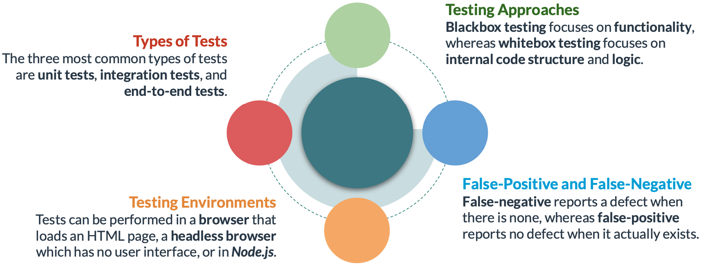

# Testing

### Common Types of Tests

### Testing Environments

There are three types of environments where JavaScript tests can be executed:

### Black-box Testing and White-box Testing

The following highlights the main differences between the two testing approaches.

### **Creating Test Functions in JavaScript**

The following shows two functions that are created and used together to run a unit test.

### **Using Methods of the Console API for Testing**

### Assert

The console.assert() method can be used to test an assertion. The assertion is the first parameter. If the assertion is true, nothing happens. If the assertion is false, then as error message is displayed. The error message is the second parameter. This message can be an object that contains multiple pieces of information.

---

The following basic examples show how to use the console API methods for testing

### Testing DOM Manipulation

Changes made to the DOM by an application function can be tested. For instance, a DOM element should appear or disappear on the click of a button. DOM events can be simulated using native JavaScript functions, and their results can be verified using test functions.

### **Testing an Asynchronous Function**

Asynchronous functions can be tested by invoking the function, simulating the asynchronous request, and then verifying the results. The response is mocked to avoid the need to submit a request and wait for a response from an actual server.

[Testing Implementation Details](https://kentcdodds.com/blog/testing-implementation-details)