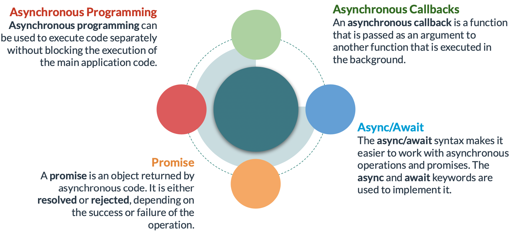

# Asynchronous programming

A promise is an object that is returned by asynchronous code and represents the completion or failure of the asynchronous operation. It is either resolved or rejected. A .then() block can be used to handle a promise when it is resolved. A .catch() block can be used to handle a promise when it is rejected. Multiple .then() blocks can be used when multiple asynchronous operations need to be executed. The async/await syntax can be used to make it easier to work with promises. It requires the use of async and await keywords. The async keyword is added to the front of a function that should contain asynchronous code. The await keyword is added to the front of an asynchronous function call that returns a promise.




### **Asynchronous Callbacks**

An asynchronous callback is a function that is provided as an argument when calling another function that executes code in the background.

This example uses addEventListener to associate an asynchronous callback with the 'complete' button.

```jsx
document.querySelector('#complete').addEventListener('click', (event) => {
	console.log('Button was clicked!');
});
console.log('initial code has finished.')

// OUTPUT:
// initial code has finished.
// Button was clicked!
```

[Introduction: callbacks](https://javascript.info/callbacks)

### Promise

The constructor syntax for a promise object is:

```jsx
let promise = new Promise(function(resolve, reject) {
  // executor
});
```

The `promise` object returned by the `new Promise` constructor has these internal properties:

- `state` — initially `"pending"`, then changes to either `"fulfilled"` when `resolve` is called or `"rejected"` when `reject` is called.
- `result` — initially `undefined`, then changes to `value` when `resolve(value)` called or `error`when `reject(error)` is called.

Its arguments `resolve` and `reject` are callbacks provided by JavaScript itself. Our code is only inside the executor.

When the executor obtains the result, be it soon or late, doesn’t matter, it should call one of these callbacks:

- `resolve(value)` — if the job is finished successfully, with result `value`.
- `reject(error)` — if an error has occurred, `error` is the error object.


A promise is an object that represents the completion or failure of an asynchronous task. If implemented, it is returned by asynchronous code.


When the `fetch()` method is used to fetch a resource, it returns a promise. A .then() block can be used to execute code when the asynchronous operation is successful. A .catch() block can be used to handle failure.

In this example, fetch is used to retrieve a todo

```jsx
fetch('https://jsonplaceholder.typicode.com/todos/1')
.then(resp => resp.json()) // Convert response to JSON object.
.then(todo => console.log(todo)) // Display todo 
.catch(err => console.error('Problem fetching data', err)); // If there’s an error, display it.Output
```


When a promise is created, `resolve(value)` or `reject(error)` is called.

```jsx
let promise = new Promise(function(resolve, reject) {
  // the function is executed automatically when the promise is constructed

  // after 1 second signal that the job is done with the result "done"
  setTimeout(() => resolve("done"), 1000);
});
```

And now an example of the executor rejecting the promise with an error:

```jsx
let promise = new Promise(function(resolve, reject) {
  // after 1 second signal that the job is finished with an error
  setTimeout(() => reject(new Error("Whoops!")), 1000);
});
```

**There can be only a single result or an error**

The executor should call only one `resolve` or one `reject`. Any state change is final.

All further calls of `resolve` and `reject` are ignored:

```jsx
let promise = new Promise(function(resolve, reject) {
  resolve("done");

  reject(new Error("…")); // ignored
  setTimeout(() => resolve("…")); // ignored
});
```

### **Consumers: then, catch, finally**

The most important, fundamental one is `.then`.

```jsx
promise.then(
  function(result) { /* handle a successful result */ },
  function(error) { /* handle an error */ }
);
```

The first argument of `.then` is a function that runs when the promise is resolved, and receives the result.

The second argument of `.then` is a function that runs when the promise is rejected, and receives the error.

For instance, here’s a reaction to a successfully resolved promise:

```jsx
let promise = new Promise(function(resolve, reject) {
  setTimeout(() => resolve("done!"), 1000);
});

// resolve runs the first function in .then
promise.then(
  result => alert(result), // shows "done!" after 1 second
  error => alert(error) // doesn't run
);
```

And in the case of a rejection, the second one:

```jsx
let promise = new Promise(function(resolve, reject) {
  setTimeout(() => reject(new Error("Whoops!")), 1000);
});

// reject runs the second function in .then
promise.then(
  result => alert(result), // doesn't run
  error => alert(error) // shows "Error: Whoops!" after 1 second
);
```

If we’re interested only in successful completions, then we can provide only one function argument to `.then`:

```jsx
let promise = new Promise(resolve => {
  setTimeout(() => resolve("done!"), 1000);
});

promise.then(alert); // shows "done!" after 1 second
```

If we’re interested only in errors, then we can use `null` as the first argument: `.then(null, errorHandlingFunction)`. Or we can use `.catch(errorHandlingFunction)`, which is exactly the same:

```jsx
let promise = new Promise((resolve, reject) => {
  setTimeout(() => reject(new Error("Whoops!")), 1000);
});

// .catch(f) is the same as promise.then(null, f)
promise.catch(alert); // shows "Error: Whoops!" after 1 second
```

Just like there’s a `finally` clause in a regular `try {...} catch {...}`, there’s `finally` in promises.

`finally` is a good handler for performing cleanup, e.g. stopping our loading indicators, as they are not needed anymore, no matter what the outcome is.

```jsx
new Promise((resolve, reject) => {
  /* do something that takes time, and then call resolve/reject */
})
  // runs when the promise is settled, doesn't matter successfully or not
  .finally(() => stop loading indicator)
  // so the loading indicator is always stopped before we process the result/error
  .then(result => show result, err => show error)
```

Two or more asynchronous operations can be executed consecutively, in which case multiple .then() blocks can be used. This is called promise chaining. A single .catch() block can be used at the end for error handling.

```jsx
fetch('https://swapi.dev/api/') // Initial fetch request to retrieve possible urls returns a promise.
  .then(resp => resp.json())    // Processing the response with json() returns a promise.
  .then(urls => {
	   return fetch(urls.people);   // Using one of the urls to fetch the people returns another promise.
	})
  then(resp2 => resp2.json())     // Processing this response returns a promise.
  then(data=>console.log(data))
 .catch(error=>console.error(error)); // Using a .catch() block for error handling.
```

### **Promise Methods**

**Promise.all**

Accepts an array of promises and returns a new promise. It is resolved when all the specified promises are resolved.

For instance, the `Promise.all` below settles after 3 seconds, and then its result is an array `[1, 2, 3]`:

```jsx
Promise.all([
  new Promise(resolve => setTimeout(() => resolve(1), 3000)), // 1
  new Promise(resolve => setTimeout(() => resolve(2), 2000)), // 2
  new Promise(resolve => setTimeout(() => resolve(3), 1000))  // 3
]).then(alert); // 1,2,3 when promises are ready: each promise contributes an array member
```

Please note that the order of the resulting array members is the same as in its source promises. Even though the first promise takes the longest time to resolve, it’s still first in the array of results.

If any of the promises is rejected, the promise returned by **`Promise.all`** immediately rejects with that error.

```jsx
Promise.all([
  new Promise((resolve, reject) => setTimeout(() => resolve(1), 1000)),
  new Promise((resolve, reject) => setTimeout(() => reject(new Error("Whoops!")), 2000)),
  new Promise((resolve, reject) => setTimeout(() => resolve(3), 3000))
]).catch(alert); // Error: Whoops!
```

**`Promise.all(iterable)` allows non-promise “regular” values in `iterable`**

Normally, `Promise.all(...)` accepts an iterable (in most cases an array) of promises. But if any of those objects is not a promise, it’s passed to the resulting array “as is”.

For instance, here the results are `[1, 2, 3]`:

```jsx
Promise.all([
  new Promise((resolve, reject) => {
    setTimeout(() => resolve(1), 1000)
  }),
  2,
  3
]).then(alert); // 1, 2, 3
```

### **Promise.allSettled**

Accepts an array of promises and returns the status and value/error for each promise.

`Promise.allSettled` just waits for all promises to settle, regardless of the result. The resulting array has:

- `{status:"fulfilled", value:result}` for successful responses,
- `{status:"rejected", reason:error}` for errors.

For example, we’d like to fetch the information about multiple users. Even if one request fails, we’re still interested in the others.

```jsx
let urls = [
  'https://api.github.com/users/iliakan',
  'https://api.github.com/users/remy',
  'https://no-such-url'
];

Promise.allSettled(urls.map(url => fetch(url)))
  .then(results => { // (*)
    results.forEach((result, num) => {
      if (result.status == "fulfilled") {
        alert(`${urls[num]}: ${result.value.status}`);
      }
      if (result.status == "rejected") {
        alert(`${urls[num]}: ${result.reason}`);
      }
    });
  });
```

The `results` in the line `(*)` above will be:

```jsx
[
  {status: 'fulfilled', value: ...response...},
  {status: 'fulfilled', value: ...response...},
  {status: 'rejected', reason: ...error object...}
]
```

So for each promise we get its status and `value/error`.

### **Promise.race**

Similar to `Promise.all`, but waits only for the first settled promise and gets its result (or error).

```jsx
Promise.race([
  new Promise((resolve, reject) => setTimeout(() => resolve(1), 1000)),
  new Promise((resolve, reject) => setTimeout(() => reject(new Error("Whoops!")), 2000)),
  new Promise((resolve, reject) => setTimeout(() => resolve(3), 3000))
]).then(alert); // 1
```

The first promise here was fastest, so it became the result. After the first settled promise “wins the race”, all further results/errors are ignored.

### **Promise.any**

Similar to `Promise.race`, but waits only for the first fulfilled promise and gets its result. If all of the given promises are rejected, then the returned promise is rejected with `[AggregateError](https://developer.mozilla.org/en-US/docs/Web/JavaScript/Reference/Global_Objects/AggregateError)` – a special error object that stores all promise errors in its `errors` property.

```jsx
Promise.any([
  new Promise((resolve, reject) => setTimeout(() => reject(new Error("Whoops!")), 1000)),
  new Promise((resolve, reject) => setTimeout(() => resolve(1), 2000)),
  new Promise((resolve, reject) => setTimeout(() => resolve(3), 3000))
]).then(alert); // 1
```

The first promise here was fastest, but it was rejected, so the second promise became the result. After the first fulfilled promise “wins the race”, all further results are ignored.

Here’s an example when all promises fail:

```jsx
Promise.any([
  new Promise((resolve, reject) => setTimeout(() => reject(new Error("Ouch!")), 1000)),
  new Promise((resolve, reject) => setTimeout(() => reject(new Error("Error!")), 2000))
]).catch(error => {
  console.log(error.constructor.name); // AggregateError
  console.log(error.errors[0]); // Error: Ouch!
  console.log(error.errors[1]); // Error: Error!
});
```

### Summary

There are 6 static methods of `Promise` class:

1. `Promise.all(promises)` – waits for all promises to resolve and returns an array of their results. If any of the given promises rejects, it becomes the error of `Promise.all`, and all other results are ignored.
2. `Promise.allSettled(promises)` (recently added method) – waits for all promises to settle and returns their results as an array of objects with:
    - `status`: `"fulfilled"` or `"rejected"`
    - `value` (if fulfilled) or `reason` (if rejected).
3. `Promise.race(promises)` – waits for the first promise to settle, and its result/error becomes the outcome.
4. `Promise.any(promises)` (recently added method) – waits for the first promise to fulfill, and its result becomes the outcome. If all of the given promises are rejected, `[AggregateError](https://developer.mozilla.org/en-US/docs/Web/JavaScript/Reference/Global_Objects/AggregateError)` becomes the error of `Promise.any`.
5. `Promise.resolve(value)` – makes a resolved promise with the given value.
6. `Promise.reject(error)` – makes a rejected promise with the given error.

Of all these, `Promise.all` is probably the most common in practice.

[Promise API](https://javascript.info/promise-api)

### **Async/Await**

**Async functions**

There’s a special syntax to work with promises in a more comfortable fashion, called “async/await”. It’s surprisingly easy to understand and use.

```jsx
async function f() {
  return 1;
}
```

The word “async” before a function means one simple thing: a function always returns a promise. Other values are wrapped in a resolved promise automatically.

For instance, this function returns a resolved promise with the result of `1`; let’s test it:

```jsx
async function f() {
  return 1;
}

f().then(alert); // 1
```

**Await**

```jsx
// works only inside async functions
let value = await promise;
```

The keyword `await` makes JavaScript wait until that promise settles and returns its result.

```jsx
async function f() {

  let promise = new Promise((resolve, reject) => {
    setTimeout(() => resolve("done!"), 1000)
  });

  let result = await promise; // wait until the promise resolves (*)

  alert(result); // "done!"
}

f();
```

The function execution “pauses” at the line `(*)` and resumes when the promise settles, with `result`becoming its result. So the code above shows “done!” in one second.

**Error handling**

We can catch that error using `try..catch`, the same way as a regular `throw`:

```jsx
async function f() {

  try {
    let response = await fetch('http://no-such-url');
  } catch(err) {
    alert(err); // TypeError: failed to fetch
  }
}

f();
```

If we don’t have `try..catch`, then the promise generated by the call of the async function `f()` becomes rejected. We can append `.catch` to handle it:

```jsx
async function f() {
  let response = await fetch('http://no-such-url');
}

// f() becomes a rejected promise
f().catch(alert); // TypeError: failed to fetch // (*)
```

### Links

[Promises, async/await](https://javascript.info/async)